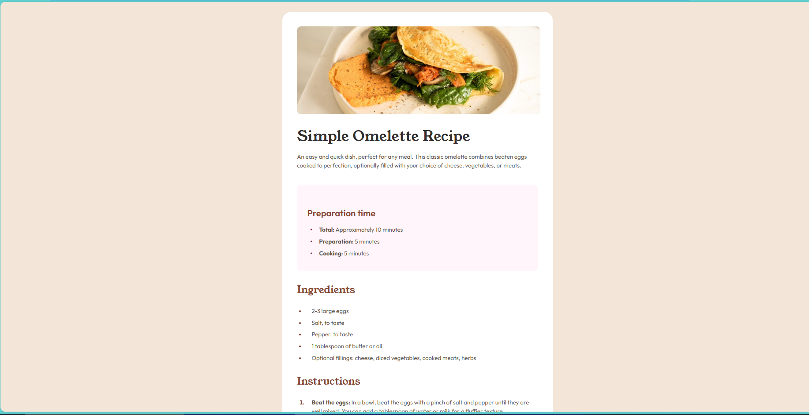

# 🍳 Simple Omelette Recipe - Frontend Mentor Challenge

<div align="center">


**A beautifully crafted, responsive recipe page showcasing modern web
development practices**

[🚀 Live Demo](#-live-demo) • [📋 Features](#-features) •
[🛠️ Installation](#️-installation) • [📱 Screenshots](#-screenshots)

</div>

---

## 📋 Table of Contents

- [🔍 Overview](#-overview)
- [🌟 Features](#-features)
- [🎨 Design System](#-design-system)
- [🏗️ Project Structure](#️-project-structure)
- [🛠️ Installation](#️-installation)
- [📱 Screenshots](#-screenshots)
- [💻 Technologies Used](#-technologies-used)
- [📐 Responsive Design](#-responsive-design)
- [🎯 Accessibility](#-accessibility)
- [🚀 Live Demo](#-live-demo)
- [📝 Development Process](#-development-process)
- [🏆 What I Learned](#-what-i-learned)
- [🔮 Future Enhancements](#-future-enhancements)
- [👨‍💻 Author](#-author)
- [🙏 Acknowledgments](#-acknowledgments)
- [📄 License](#-license)

---

## 🔍 Overview

This project is a responsive recipe page built as part of a Frontend Mentor
challenge. It showcases a clean, modern design for displaying a simple omelette
recipe with proper typography, color schemes, and responsive layouts that work
seamlessly across all devices.

### 🎯 Challenge Goals

- Create a pixel-perfect replica of the provided design
- Implement responsive design for mobile and desktop
- Follow modern web development best practices
- Ensure accessibility and semantic HTML structure

---

## 🌟 Features

### ✨ **Visual Excellence**

- 🎨 Beautiful, modern design with custom color palette
- 📸 Hero image with elegant presentation
- 🔤 Professional typography using Google Fonts
- 🌈 Consistent color scheme throughout

### 📱 **Responsive Design**

- 📲 Mobile-first approach
- 🖥️ Desktop optimization
- 🔄 Fluid layouts that adapt to any screen size
- 📐 Proper spacing and proportions at all breakpoints

### 🎯 **User Experience**

- 📋 Clear content hierarchy
- 👁️ Easy-to-scan recipe format
- ⏱️ Quick preparation time overview
- 📊 Nutritional information table

### ♿ **Accessibility**

- 🎨 WCAG compliant color contrasts
- 📖 Semantic HTML structure
- 🔍 Screen reader friendly
- ⌨️ Keyboard navigation support

---

## 🎨 Design System

### 🎨 **Color Palette**

```css
/* Primary Colors */
--white: hsl(0, 0%, 100%)           /* 🤍 Pure White */
--stone-100: hsl(30, 54%, 90%)      /* 🏳️ Light Stone */
--stone-150: hsl(30, 18%, 87%)      /* 🏳️ Medium Stone */
--stone-600: hsl(30, 10%, 34%)      /* 🪨 Dark Stone */
--stone-900: hsl(24, 5%, 18%)       /* ⚫ Charcoal */

/* Accent Colors */
--brown-800: hsl(14, 45%, 36%)      /* 🤎 Rich Brown */
--rose-800: hsl(332, 51%, 32%)      /* 🌹 Deep Rose */
--rose-50: hsl(330, 100%, 98%)      /* 🌸 Light Rose */
```

### 🔤 **Typography**

- **Headings**: Young Serif (400)
- **Body Text**: Outfit (400, 600, 700)
- **Base Size**: 16px
- **Line Height**: 1.5

### 📏 **Spacing System**

- **Container**: 736px max-width
- **Padding**: 40px (desktop), 32px (mobile)
- **Border Radius**: 24px (container), 12px (elements)

---

## 🏗️ Project Structure

```
recipe-page/
│
├── 📄 index.html              # Main HTML file
├── 🎨 styles/                 # CSS stylesheets (embedded)
├── 🖼️ assets/                 # Images and media
│   └── images/
│       └── favicon-32x32.png
├── 📚 docs/                   # Documentation
│   ├── style-guide.md         # Design specifications
│   └── screenshots/           # Project screenshots
└── 📖 README.md               # Project documentation
```

---

## 🛠️ Installation

### 📥 **Quick Start**

1. **Clone the repository**

   ```bash
   git clone https://github.com/yourusername/recipe-page.git
   cd recipe-page
   ```

2. **Open in browser**

   ```bash
   # Simply open index.html in your preferred browser
   open index.html
   # or
   python -m http.server 8000
   ```

3. **Development setup** (optional)

   ```bash
   # If using a local server
   npx serve .
   # or
   npx live-server
   ```

### 🔧 **Requirements**

- ✅ Modern web browser (Chrome, Firefox, Safari, Edge)
- ✅ No build tools required
- ✅ No dependencies needed

---

## 📱 Screenshots

### 🖥️ **Desktop View (1440px)**

<div align="center">
  
</div>

### 📱 **Mobile View (375px)**

<div align="center">
  
</div>

### 🎨 **Design Comparison**

|                    Original Design                     |                      My Implementation                      |
| :----------------------------------------------------: | :---------------------------------------------------------: |
|  |  |

---

## 💻 Technologies Used

### 🏗️ **Core Technologies**

- 
  **HTML5** - Semantic markup
- 
  **CSS3** - Modern styling with Grid & Flexbox
- 
  **Google Fonts** - Typography

### 🎨 **CSS Features**

- 📐 **CSS Grid & Flexbox** - Modern layout systems
- 🎨 **Custom Properties** - CSS variables for maintainable code
- 📱 **Media Queries** - Responsive breakpoints
- 🎭 **Pseudo-elements** - Custom styling details
- 🌈 **HSL Color System** - Professional color management

### 🛠️ **Development Tools**

- 🔍 **Chrome DevTools** - Testing and debugging
- 📏 **Responsive Design Mode** - Multi-device testing
- ♿ **Accessibility Inspector** - WCAG compliance

---

## 📐 Responsive Design

### 📱 **Mobile First Approach**

Starting with mobile design ensures optimal performance and user experience
across all devices.

```css
/* Mobile Base Styles (375px+) */
.container {
	margin: 0;
	border-radius: 0;
	max-width: 100%;
}

/* Desktop Enhancement (768px+) */
@media (min-width: 768px) {
	.container {
		max-width: 736px;
		margin: 128px auto;
		border-radius: 24px;
	}
}
```

### 🎯 **Breakpoints**

- 📱 **Mobile**: 320px - 767px
- 🖥️ **Desktop**: 768px+
- 📐 **Container**: Max 736px centered

### 🔄 **Flexible Elements**

- Images scale proportionally
- Text reflows naturally
- Spacing adjusts contextually
- Touch targets meet accessibility standards

---

## 🎯 Accessibility

### ♿ **WCAG 2.1 Compliance**

- ✅ **Color Contrast**: AA level compliance
- ✅ **Semantic HTML**: Proper heading hierarchy
- ✅ **Alt Text**: Descriptive image alternatives
- ✅ **Focus Management**: Keyboard navigation
- ✅ **Screen Readers**: ARIA labels where needed

### 🎨 **Visual Accessibility**

- High contrast ratios (4.5:1 minimum)
- Clear visual hierarchy
- Sufficient white space
- Readable font sizes (16px minimum)

### ⌨️ **Keyboard Navigation**

- Tab order follows content flow
- Focus indicators visible
- No keyboard traps
- Skip links available

---

## 🚀 Live Demo



### 🌐 **View Online**

- **Solution URL**: [Github Repo](https://github.com/JonesKwameOsei/recipe-page)
- **GitHub Pages**: [Live Demo](https://joneskwameosei.github.io/recipe-page/)
<!-- - **Netlify**: [Alternative Demo](https://your-recipe-page.netlify.app) -->

### 🔗 **Quick Links**

- 📋 [Frontend Mentor Challenge](https://www.frontendmentor.io/challenges)
- 🎨 [Design Files](https://www.frontendmentor.io/pro)
- 💻 [Source Code](https://github.com/yourusername/recipe-page)

---

## 📝 Development Process

### 🎯 **Phase 1: Analysis**

1. 📊 Studied design specifications
2. 🎨 Analyzed color palette and typography
3. 📱 Identified responsive requirements
4. ♿ Planned accessibility features

### 🏗️ **Phase 2: Structure**

1. 📄 Created semantic HTML structure
2. 🎨 Set up CSS custom properties
3. 📐 Implemented responsive grid system
4. 🔤 Configured Google Fonts

### 🎨 **Phase 3: Styling**

1. 🎭 Applied design system
2. 📱 Implemented responsive layouts
3. ✨ Added interactive elements
4. 🔍 Fine-tuned details

### 🧪 **Phase 4: Testing**

1. 📱 Cross-device testing
2. 🌐 Cross-browser compatibility
3. ♿ Accessibility validation
4. ⚡ Performance optimization

---

## 🏆 What I Learned

### 💡 **Technical Skills**

- 🎨 **Modern CSS**: Flexbox, Custom Properties
- 📱 **Responsive Design**: Mobile-first methodology
- ♿ **Accessibility**: WCAG guidelines implementation
- 🎭 **Design Systems**: Consistent styling approaches

### 🧠 **Soft Skills**

- 👁️ **Attention to Detail**: Pixel-perfect implementation
- 🔍 **Problem Solving**: Responsive challenge solutions
- 📋 **Project Management**: Structured development approach
- 📚 **Documentation**: Clear project communication

### 🚀 **Best Practices**

- 📝 Semantic HTML structure
- 🎨 CSS organization and naming
- 📱 Progressive enhancement
- ♿ Inclusive design principles

---

## 🔮 Future Enhancements

### ⭐ **Planned Features**

- [ ] 🎬 **Animations**: Smooth transitions and micro-interactions
- [ ] 🌙 **Dark Mode**: Toggle between light and dark themes
- [ ] 🔄 **Recipe Variations**: Multiple recipe options
- [ ] 📱 **PWA**: Progressive Web App functionality
- [ ] 🌍 **Internationalization**: Multi-language support

### 🛠️ **Technical Improvements**

- [ ] ⚡ **Performance**: Image optimization and lazy loading
- [ ] 🔍 **SEO**: Enhanced meta tags and structured data
- [ ] 📊 **Analytics**: User behavior tracking
- [ ] 🧪 **Testing**: Automated testing suite

### 🎨 **Design Enhancements**

- [ ] 🎭 **Advanced Animations**: CSS transitions and keyframes
- [ ] 📸 **Image Gallery**: Multiple recipe photos
- [ ] 🎨 **Theme Customization**: User preference settings
- [ ] 📱 **Native App**: React Native or Flutter version

---

## 👨‍💻 Author

<div align="center">

### **Jones Osei** 👋

[](https://yourportfolio.com)
[](https://www.linkedin.com/in/jonesose)
[](https://github.com/JonesKwameOsei)

<!-- [](https://twitter.com/yourhandle) -->

**Frontend Developer passionate about creating beautiful, accessible web
experiences**

📧 **Email**: <your.email@example.com>  
🌍 **Location**: Your City, Country  
💼 **Available for**: Freelance projects and full-time opportunities

</div>

---

## 🙏 Acknowledgments

### 🎓 **Learning Resources**

- 🏆 [Frontend Mentor](https://www.frontendmentor.io) - Challenge platform
- 📚 [MDN Web Docs](https://developer.mozilla.org) - Technical documentation
- 🎨 [Google Fonts](https://fonts.google.com) - Typography resources
- ♿ [WebAIM](https://webaim.org) - Accessibility guidelines

### 💡 **Inspiration**

- 🍳 Recipe design trends
- 📱 Modern mobile interfaces
- 🎨 Contemporary web design
- ♿ Inclusive design principles

### 🤝 **Community**

- Frontend Mentor Discord community
- CSS-Tricks community
- Stack Overflow contributors
- Web development Twitter community

---

## 📄 License

This project is not licensed, you are free to use it for any purpose.

<!-- under the **MIT License** - see the
[LICENSE.md](LICENSE.md) file for details. -->

<!-- ### 📋 **License Summary**

- ✅ Commercial use allowed
- ✅ Modification allowed
- ✅ Distribution allowed
- ✅ Private use allowed
- ❌ Warranty not provided
- ❌ Liability not accepted -->

---

<div align="center">

### 🌟 **Star this repo if you found it helpful!** ⭐

**Made with ❤️ and lots of ☕**

---

**© 2025 Jones Osei. All rights reserved.**

</div>

